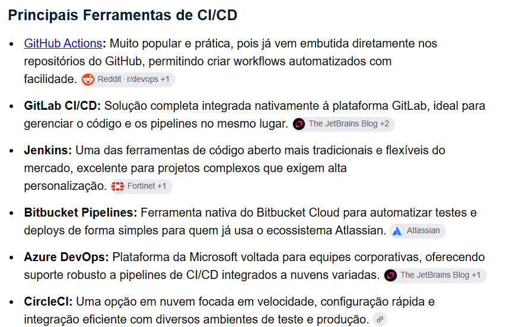

#Novo Projeto

git init 
- iniciar um novo projeto no git 

git add <nome-aqrquivo>
- add os estão prontos para serem commitados 

git commit -m "mensagem de commit"
- commit os arquivos no historico

git log 
- mostra os ultimos commit, log de alterações 

git status 
- como está o estado da nossa ramificações 

git diff 
- que mostra o que foi alterado 
- o que tem de alteração na ramificação 

git merge 
- merge de ramificações, mescla ramificações

git branch 
- mostra a branch atual

git branch -b <nome-do-branch>
- cria uma nova branch a partir do historico da branch atual

git checkout <nome-da-branch>
- ele muda de branch 

git branch -b <nome-da-branch>
- criar uma nova branch a partir da branch atual que estamos 

git remote add <nome> <url>
- add um novo repositorio remoto 

git push <nome> <nome-da-branch>
- manda nossas alterações locais para o repositorio remoto, pra cada branch 

git pull <nome> <nome-da-branch>
- pega as alterações do repositorio remoto, e joga pra nossa maquina

git fetch 
- atualiza o novo historico local de acordo com o historico salvo la no repositorio remoto
- sincronizaçõa do local com o remoto 

# 